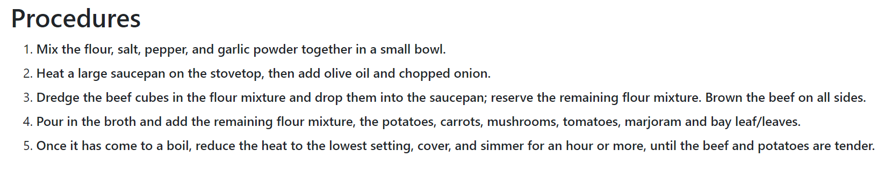

# 🍽️ Plateful Palette

**Plateful Palette** is more than just a recipe app—it's your personal kitchen assistant that transforms the way you cook. Whether you're a busy professional, a health-conscious individual, or just someone trying to make the most out of what's in your pantry, Plateful Palette has you covered. Say goodbye to the endless scroll of recipe websites and hello to smart, personalized meal suggestions.

## 🌟 Why Plateful Palette?

- **Transform Your Ingredients**: Ever stared at your pantry and wondered what to cook? Input the ingredients you have, and Plateful Palette will suggest creative and delicious recipes, minimizing food waste and maximizing flavor.
  
- **Health in Focus**: Each recipe comes with detailed nutritional information, helping you make choices that align with your dietary goals—whether you're counting calories, tracking macros, or managing dietary restrictions.
  
- **Explore New Culinary Horizons**: Get suggestions for additional ingredients that can expand your culinary repertoire. Discover new dishes that you never thought possible with what you already have.

- **Tailored Just for You**: Customize your profile with dietary preferences and nutritional goals. Whether you're vegan, gluten-free, or just trying to eat healthier, Plateful Palette serves up recipes that suit your lifestyle.

- **Join the Community**: Share your favorite recipes, rate others, and take part in cooking challenges. Plateful Palette isn't just an app—it's a community of food lovers like you.

## 🚀 Key Features

- **Smart Recipe Suggestions**: Based on the ingredients you have, the app suggests recipes, reducing food waste and enhancing your cooking experience.
  
- **Comprehensive Nutritional Info**: View detailed nutritional information for each recipe, helping you stay on track with your health goals.
  
- **Ingredient Expansion**: Get recommendations for new ingredients that can turn your basic ingredients into gourmet meals.

## 🛠️ Technical Overview

Plateful Palette is built using a robust tech stack that ensures a smooth and responsive user experience. Here’s how it all works:

### 🔧 Technology Stack

- **Frontend**: Built with HTML, CSS, and JavaScript for a responsive and interactive user interface.
  
- **Backend**: Powered by Django, providing the logic for handling requests, managing user sessions, and interfacing with the database.
  
- **Database**: SQLite3 stores user data, recipes, and nutritional information efficiently.
  
- **APIs**: Integrated with external services like Wikibook and Nutritionix to fetch the latest recipes and nutritional data.
  
- **Hosting**: Deployed on AWS with NGINX to ensure high availability and scalability.

### ⚙️ How It Works

1. **User Authentication**: Django’s built-in authentication system handles user registration, login, and profile management.

2. **Ingredient Input & Recipe Suggestion**: Users input ingredients, which the backend processes to find matching recipes in the database. If no matches are found, the app queries external APIs to fetch new recipes.

3. **Nutritional Information**: For each recipe, the app pulls detailed nutritional data from the Nutritionix API and displays it to the user.

### 🧩 System Architecture

- **Frontend**: The user interface is built using HTML, CSS, and JavaScript, ensuring a smooth and responsive user experience.
  
- **Backend**: Django handles the server-side logic, managing requests and interfacing with the database to serve up the right recipes and nutritional data.
  
- **Database**: SQLite3 is used for storing user data, recipes, and nutritional information. It's lightweight yet powerful enough for the needs of the app.
  
- **APIs**: Integration with Wikibook and Nutritionix APIs enriches the app with up-to-date recipes and nutritional data.
  
- **Hosting**: AWS with NGINX is used to host the app, ensuring it's fast, reliable, and can handle a large number of users.

### 🎓 Running the Project

1. **Clone the Repository**:
   ```bash
   git clone https://github.com/yourusername/plateful-palette.git
   cd plateful-palette

## Some images of our products:
1. **Home page**


2. **Food page**


3. **Ingredient page**


4. **Food recipe page**




